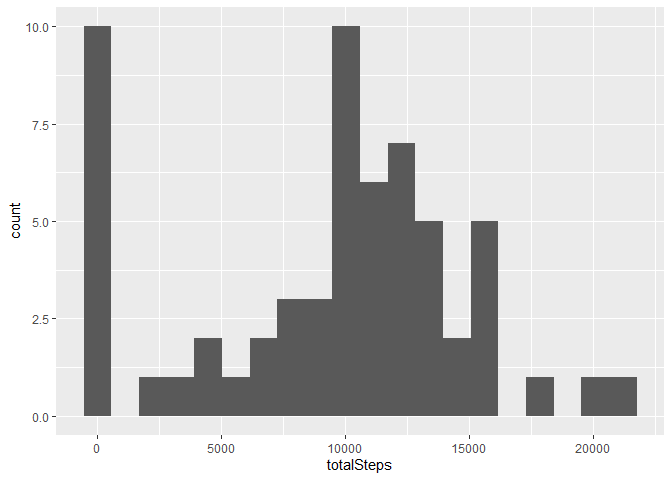
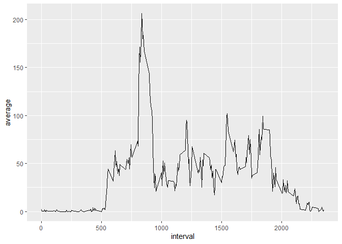
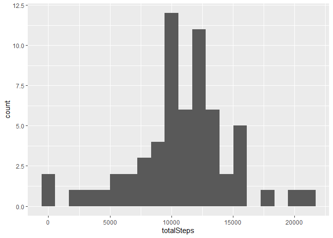
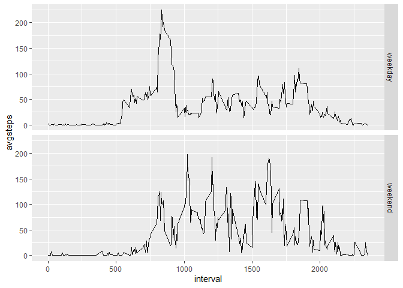

##Getting the data  
The following code loads the necessary libraries, downloads, unzips, and loads the data into a data frame named activity  

```r
library(tidyverse)

#Creating a directory to work
if(!dir.exists("reproducible"))
    dir.create("reproducible")

setwd("reproducible")

download.file("https://d396qusza40orc.cloudfront.net/repdata%2Fdata%2Factivity.zip", destfile = "activitydata.zip")

unzip("activitydata.zip")

activity <- read.csv("~/R/reproducible/activity.csv")

activity$date <- as.Date(activity$date)
```

## Question 1 - What is mean total number of steps taken per day?

First, let's use dplyr to quickly summarise the table and group by date  

```r
activityday <- select(activity, steps, date) %>% 
                group_by(date) %>% 
                summarise(totalSteps = sum(steps, na.rm = TRUE))
```

And then, use ggplot2 to plot the histogram  

```r
histogram <- ggplot(data = activityday) +
             geom_histogram(mapping = aes(x = totalSteps), bins = 20)
summary(activityday$totalSteps)
```

```
##    Min. 1st Qu.  Median    Mean 3rd Qu.    Max. 
##       0    6778   10395    9354   12811   21194
```

```r
histogram
```

<!-- -->
  
  
We can observe, most frequently, days with 0 steps (which could indicate a systemic problem) or about 10000 (which is around the daily recommended by the USA CDC for most adults https://www.cdc.gov/physicalactivity/basics/adults/). This is also confirmed by mean and median statistics.  

## Question 2 - What is the average daily activity pattern?


First, let's use dplyr to quickly summarise the table and group by interval

```r
activityinterval <- select(activity, steps, interval) %>% 
                group_by(interval) %>% 
                summarise(average = mean(steps, na.rm = TRUE))

activityinterval[which.max(activityinterval$average),]
```

```
## # A tibble: 1 x 2
##   interval average
##      <int>   <dbl>
## 1      835    206.
```

```r
qplot(interval,average, data = activityinterval, geom = "line")
```

<!-- -->
  
We can observe that the 5-minute interval between 8:35 and 8:40 has the highest average across all days with around 206 steps. The plot also tells ys that the number of steps spikes around that interval.  

## Question 3 - Imputing missing values
  
First let's get a sense of how the NAs are distributed over the data

```r
#Getting the weekdays for the data
activity$day <- weekdays(activity$date)
#Subsets only the missing data
nas <- activity[is.na(activity$steps),]

#Shows how many rows have NA
nrow(nas)
```

```
## [1] 2304
```

```r
#NAs by date
nas %>% group_by(date) %>% summarise(n = n())
```

```
## # A tibble: 8 x 2
##   date           n
##   <date>     <int>
## 1 2012-10-01   288
## 2 2012-10-08   288
## 3 2012-11-01   288
## 4 2012-11-04   288
## 5 2012-11-09   288
## 6 2012-11-10   288
## 7 2012-11-14   288
## 8 2012-11-30   288
```

```r
#NAs by day of the week
nas %>% group_by(day) %>% summarise(n = n())
```

```
## # A tibble: 6 x 2
##   day               n
##   <chr>         <int>
## 1 domingo         288
## 2 quarta-feira    288
## 3 quinta-feira    288
## 4 sábado          288
## 5 segunda-feira   576
## 6 sexta-feira     576
```

We can infer that, since each date with NAs has the same (288) amount of missing info, each day with NAs is fully missing it's observations so, filling with the average steps for that day(0) will result in no difference in analysis. Since there are more weekdays with missing info than weekend days, if we fill NAs with the average for each interval, we risk altering the next analysis(average steps on weekdays vs weekend). A more neutral strategy might be filling NAs with the average for that interval on that weekday. 


```r
#Creates a data frame with average steps for interval of each weekday
avgintervalday <- activity %>% group_by(interval, day) %>%
                  summarise(avgsteps = mean(steps, na.rm = T))

#Merges the original dataframe with the average data
activity2 <- merge(activity, avgintervalday, by.x = c("interval", "day"), by.y = c("interval", "day"))

#Replace the NAs with the averages
activity2$steps <- with(activity2, coalesce(as.numeric(steps), avgsteps))

#Restores the order of the original dataframe
activity2 <- activity2[order(activity2$date, activity2$interval, decreasing = FALSE),]

#Summarizes new data by sum
activityday2 <- select(activity2, steps, date) %>% 
                group_by(date) %>% 
                summarise(totalSteps = sum(steps, na.rm = TRUE))

#Plots the new statistics and histogram
histogram2 <- ggplot(data = activityday2) +
             geom_histogram(mapping = aes(x = totalSteps), bins = 20)
summary(activityday2$totalSteps)
```

```
##    Min. 1st Qu.  Median    Mean 3rd Qu.    Max. 
##      41    8918   11015   10821   12811   21194
```

```r
histogram2
```

<!-- -->
  
As expected, since there are few days of data missing, the results haven't changed that much

## Question 4 - Are there differences in activity patterns between weekdays and weekends?

```r
#Labeling the weekend and weekdays
activity2$weekend <- as.factor(ifelse(weekdays(activity2$date, abbreviate = T) %in% c("sab", "dom"), yes = "weekend", no = "weekday"))

#Summarizing the data
activityweekend <- select(activity2, weekend, interval, steps) %>%
                    group_by(weekend, interval) %>%
                    summarise(avgsteps = mean(steps))
#Plotting the data
qplot(data = activityweekend, x = interval, y = avgsteps, facets = weekend~., geom = "line")
```

<!-- -->
  
We can observe that during weekdays, there's a peak of steps around 8:30 (going to work, maybe??) and the activity starts earlier overall. During weekends, the steps are more "evenly" distributed during the day.
  
